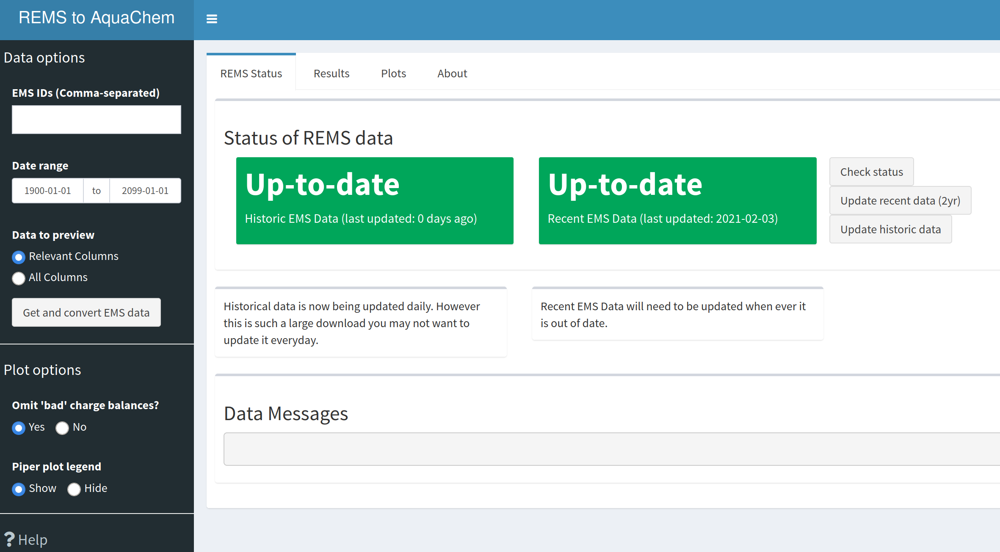

<!-- badges: start -->
[](https://github.com/bcgov/repomountie/blob/master/doc/lifecycle-badges.md)
[](https://github.com/bcgov/bcgwcat/actions/workflows/R-CMD-check.yaml)
<!-- badges: end -->

# bcgwcat - Groundwater Chemistry Analysis Tool

> *Previously known as rems2aquachem, as the scope of this tool has expanded,
> we have renamed it to better reflect what it does*

```{r, include = FALSE}
knitr::opts_chunk$set(
  comment = "#>",
  fig.path = "man/figures/",
  out.width = "100%"
)
```

The goal of bcgwcat is to provide easy access to EMS data as well as
tools specific to those working with groundwater through R functions but
also through a **Shiny user-interface**. This tool can help with:

- Downloading EMS data via the [rems](http://github.com/bcgov/rems) package
- Calculating charge balances
- Calculating water types
- Converting data to a format for importing into AquaChem
- Providing water quality summaries
- Piperplots and Stiff plots

## Quick Start

- Install [**R**](https://cloud.r-project.org/) and [**RStudio**](https://rstudio.com/)
- Install pak - `install.packages("pak")`
- Install bcgwcat - `pak::pkg_install("bcgov/bcgwcat")` [Update All if asked]
- Launch the Shiny App - `gw_app()`


## In Detail

1. [**Update RStudio**](https://rstudio.com/) (if it's been a while)
2. [**Update R**](https://cloud.r-project.org/) (if it's been a while)
3. **Open RStudio**
4. **Install pak** In the console type the following and hit enter

     ```{r, eval = FALSE}
     install.packages("pak")
     ```
5. **Install bcgwcat** In the console type the following and hit enter 
(be sure to install all updates if prompted!)
  
    ```{r, eval = FALSE}
    pak::pkg_install("bcgov/bcgwcat")
    ```
    
#### Troubleshooting

1. **Update rems** In the console type the following and hit enter

     ```{r, eval = FALSE}
     pak::pkg_install("bcgov/rems")
     ```
     
    > **Note:** If you run into errors during the rems data updates, this might 
    > be due to old rems caches. 
    > 
    > **Try the following:** 
    >  1. Uninstall rems - RStudio, go to the lower right hand window, click 
    >     on the "Packages" tab, in the search bar, search for "rems", then 
    >     click on the "X" in a circle to the right of it's name.
    > 
    > 2. Remove the rems cache - Delete the cache folders by going to 
    >    `C:\Users\YOUR_USER\AppData\Local` (windows) or 
    >    `~/Library/Application Support (mac)` and delete the "rems" folder
    > 
    > 3. Re-install rems `pak::pkg_install("bcgov/rems")` and 
    >    then try again
  
2. **Update all packages** If you run into errors right at the start, consider updating your packages.

    ```{r, eval = FALSE}
    pak::pkg_install("bcgov/bcgwcat", upgrade = TRUE)
    ```

## Using bcgwcat

#### Shiny User-Interface

Type this line into the R console at the prompt (in the screen with `>`) and
hit 'Enter'.
   ```{r, eval = FALSE}
   bcgwcat::gw_app() # Launch the app
   ```
    
**See the [tutorial](https://bcgov.github.io/bcgwcat/articles/bcgwcat.html) for a more in-depth look at how to use the User Interface**




#### R command line

bcgwcat can also be used directly from R.

To extract EMS data, and convert for use in AquaChem... (by default saved as CSV)
 
```{r example}
library(bcgwcat)
r <- rems_to_aquachem(ems_ids = c("1401030", "1401377", "E292373"))
r
```

```{r, include = FALSE}
file.remove(paste0("aquachem_", Sys.Date(), ".csv"))
```

To create plots...

```{r, out.width = "50%", fig.width = 8, fig.asp = 1}
piper_plot(r, ems_id = "1401030")
```

```{r, out.width = "50%", fig.width = 6, fig.asp = 0.75}
stiff_plot(r, ems_id = "1401030")
```


## Vignette/Tutorials

See the [bcgwcat website](https://bcgov.github.io/bcgwcat)

## License

Copyright 2024 Province of British Columbia

Licensed under the Apache License, Version 2.0 (the "License");
you may not use this file except in compliance with the License.
You may obtain a copy of the License at

http://www.apache.org/licenses/LICENSE-2.0

Unless required by applicable law or agreed to in writing, software
distributed under the License is distributed on an "AS IS" BASIS,
WITHOUT WARRANTIES OR CONDITIONS OF ANY KIND, either express or implied.
See the License for the specific language governing permissions and
limitations under the License.