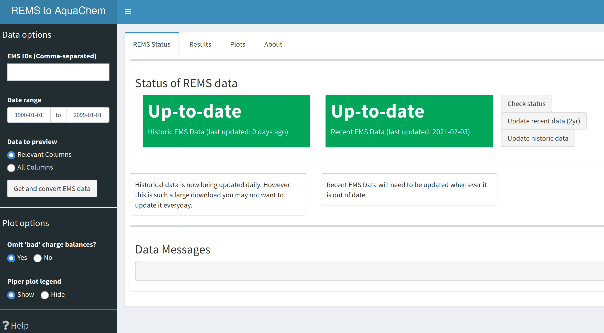
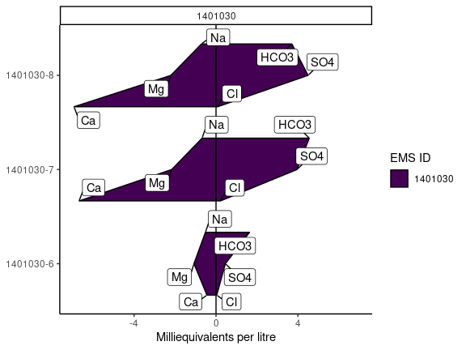
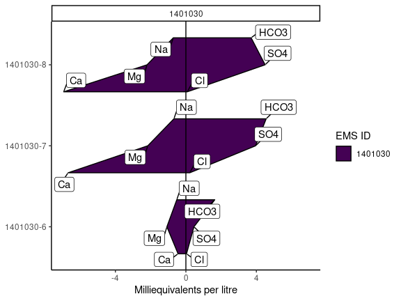

<!-- badges: start -->

[](https://github.com/bcgov/repomountie/blob/master/doc/lifecycle-badges.md)
[](https://github.com/bcgov/bcgwcat/actions/workflows/R-CMD-check.yaml)
<!-- badges: end -->

# bcgwcat - Groundwater Chemistry Analysis Tool

> *Previously known as rems2aquachem, as the scope of this tool has
> expanded, we have renamed it to better reflect what it does*

The goal of bcgwcat is to provide easy access to EMS data as well as
tools specific to those working with groundwater through R functions but
also through a **Shiny user-interface**. This tool can help with:

- Downloading EMS data via the [rems](http://github.com/bcgov/rems)
  package
- Calculating charge balances
- Calculating water types
- Converting data to a format for importing into AquaChem
- Providing water quality summaries
- Piperplots and Stiff plots

## Quick Start

- Install/Update [**R**](https://cloud.r-project.org/) and
  [**RStudio**](https://rstudio.com/)
- Install pak - `install.packages("pak", dependencies = TRUE)`
- Install bcgwcat - `pak::pkg_install("bcgov/bcgwcat")` \[Update All if
  asked\]
- Launch the Shiny App - `gw_app()`

## In Detail

1.  [**Install/Update RStudio**](https://rstudio.com/) (if it’s been a
    while)

2.  [**Install/Update R**](https://cloud.r-project.org/) (if it’s been a
    while)

3.  **Open RStudio**

4.  **Install pak** In the console type the following and hit enter

    ``` r
    install.packages("pak", dependencies = TRUE)
    ```

5.  **Check that your system is ready** Install build tools if prompted

    ``` r
    pkgbuild::check_build_tools()
    ```

6.  **Install bcgwcat** In the console type the following and hit enter
    (be sure to install all updates if prompted!)

    ``` r
    pak::pkg_install("bcgov/bcgwcat")
    ```

#### Troubleshooting

1.  **Update rems** In the console type the following and hit enter

    ``` r
    pak::pkg_install("bcgov/rems")
    ```

    > **Note:** If you run into errors during the rems data updates,
    > this might be due to old rems caches.
    >
    > **Try the following:**
    > 1.  Uninstall rems - RStudio, go to the lower right hand window,
    >     click on the “Packages” tab, in the search bar, search for
    >     “rems”, then click on the “X” in a circle to the right of it’s
    >     name.
    >
    > 2.  Remove the rems cache - Delete the cache folders by going to
    >     `C:\Users\YOUR_USER\AppData\Local` (windows) or
    >     `~/Library/Application Support (mac)` and delete the “rems”
    >     folder
    >
    > 3.  Re-install rems `pak::pkg_install("bcgov/rems")` and then try
    >     again

2.  **Update all packages** If you run into errors right at the start,
    consider updating your packages.

    ``` r
    pak::pkg_install("bcgov/bcgwcat", upgrade = TRUE)
    ```

## Using bcgwcat

#### Shiny User-Interface

Type this line into the R console at the prompt (in the screen with `>`)
and hit ‘Enter’.

``` r
bcgwcat::gw_app() # Launch the app
```

**See the
[tutorial](https://bcgov.github.io/bcgwcat/articles/bcgwcat.html) for a
more in-depth look at how to use the User Interface**

<figure>

<figcaption aria-hidden="true">Screenshot</figcaption>
</figure>

#### R command line

bcgwcat can also be used directly from R.

To extract EMS data, and convert for use in AquaChem… (by default saved
as CSV)

``` r
library(bcgwcat)
r <- rems_to_aquachem(ems_ids = c("1401030", "1401377", "E292373"))
```

    #> Checking for locally stored historical data...

    #> Last download was 5 days ago

    #> If you would like to update historical data, run 'rems::download_historic_data()'

    #> Checking for locally stored recent data...

    #> Fetching data from cache...

    #> For consistency EMS charge balances, anion sums, and cation sums have been replaced with recalculated values.
    #> See `?charge_balance` for more details.

``` r
r
```

    #> # A tibble: 16 × 178
    #>    Sample_Date  SampleID    Coord_Lat Project     Coord_Long StationID Watertype
    #>    <chr>        <chr>       <chr>     <chr>       <chr>      <chr>     <chr>    
    #>  1 ""           ""          °         ""          °          ""        ""       
    #>  2 "1987-07-07" "1401030-1" 49.20635  "BACKGROUN… -119.82532 "075"     "Fresh W…
    #>  3 "1991-08-07" "1401030-2" 49.20635  "BACKGROUN… -119.82532 "075"     "Fresh W…
    #>  4 "1994-06-08" "1401030-3" 49.20635  "BACKGROUN… -119.82532 "075"     "Fresh W…
    #>  5 "2001-09-09" "1401030-4" 49.20635  "BACKGROUN… -119.82532 "075"     "Fresh W…
    #>  6 "2009-11-11" "1401030-5" 49.20635  "BACKGROUN… -119.82532 "075"     "Fresh W…
    #>  7 "2010-08-09" "1401030-6" 49.20635  "BACKGROUN… -119.82532 "075"     "Fresh W…
    #>  8 "2016-11-02" "1401030-7" 49.20635  "BACKGROUN… -119.82532 "075"     "Fresh W…
    #>  9 "2018-06-14" "1401030-8" 49.20635  "BACKGROUN… -119.82532 "075"     "Ground …
    #> 10 "1987-07-07" "1401377-1" 49.175    "BACKGROUN… -119.7353  "203"     "Fresh W…
    #> 11 "1989-10-11" "1401377-2" 49.175    "BACKGROUN… -119.7353  "203"     "Fresh W…
    #> 12 "1994-03-24" "1401377-3" 49.175    "BACKGROUN… -119.7353  "203"     "Fresh W…
    #> 13 "2016-11-02" "1401377-4" 49.175    "BACKGROUN… -119.7353  "203"     "Fresh W…
    #> 14 "2020-06-29" "1401377-5" 49.175    "BACKGROUN… -119.7353  "203"     "Ground …
    #> 15 "2015-03-06" "E292373-1" 49.364604 "GROUNDWAT… -124.6141… "426"     "Fresh W…
    #> 16 "2017-10-11" "E292373-2" 49.364604 "GROUNDWAT… -124.6141… "426"     "Fresh W…
    #> # ℹ 171 more variables: Analysis_Date <chr>, shortWatertype <chr>,
    #> #   Comment <chr>, Reference <chr>, Quality_control <chr>, Duplicate_ID <chr>,
    #> #   Labcode <chr>, Location <chr>, Geology <chr>, X <chr>, Y <chr>,
    #> #   Elevation <chr>, Well_Depth <chr>, Screen_Top <chr>, Screen_Mid <chr>,
    #> #   Screen_Bottom <chr>, Gradient <chr>, Station_Comment <chr>,
    #> #   Sample_Depth <chr>, Temp <chr>, `14C` <chr>, `18O` <chr>, `2H` <chr>,
    #> #   Ag_diss <chr>, Ag_tot <chr>, Al_diss <chr>, Al_tot <chr>, As_diss <chr>, …

To create plots…

``` r
piper_plot(r, ems_id = "1401030")
```



``` r
stiff_plot(r, ems_id = "1401030")
```



## Vignette/Tutorials

See the [bcgwcat website](https://bcgov.github.io/bcgwcat)

## License

Copyright 2024 Province of British Columbia

Licensed under the Apache License, Version 2.0 (the “License”); you may
not use this file except in compliance with the License. You may obtain
a copy of the License at

<http://www.apache.org/licenses/LICENSE-2.0>

Unless required by applicable law or agreed to in writing, software
distributed under the License is distributed on an “AS IS” BASIS,
WITHOUT WARRANTIES OR CONDITIONS OF ANY KIND, either express or implied.
See the License for the specific language governing permissions and
limitations under the License.
