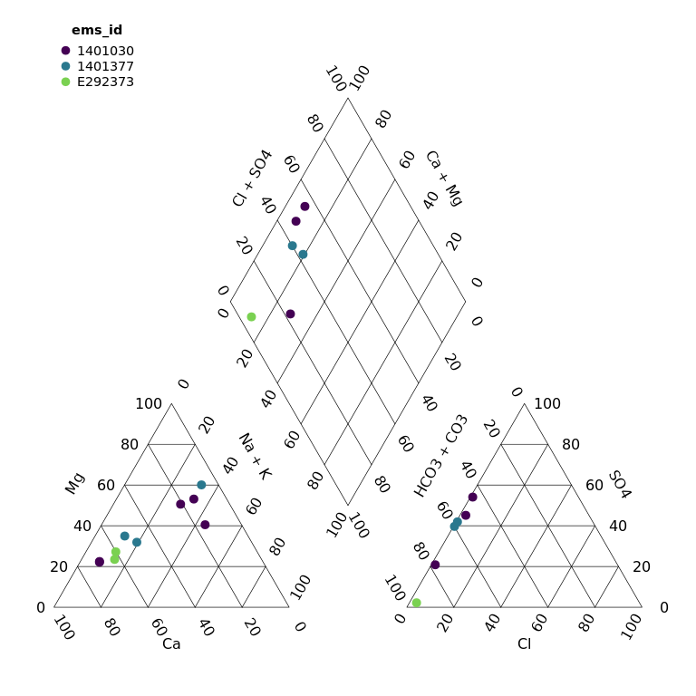
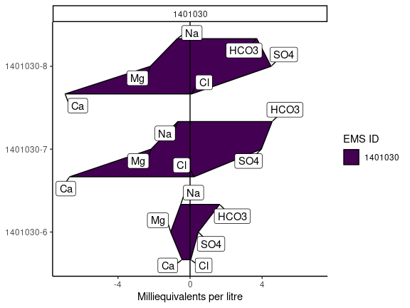

[](https://github.com/bcgov/repomountie/blob/master/doc/lifecycle-badges.md)

<!-- README.md is generated from README.Rmd. Please edit that file -->

# `rems2aquachem`

<!-- badges: start -->
<!-- [](https://travis-ci.org/bcgov/rems2aquachem) -->
<!-- badges: end -->

The goal of `rems2aquachem` is to provide a quick and painless way of
converting EMS data into a format compatible with AquaChem.

Data is first downloaded with BC Govs
[`rems`](http://github.com/bcgov/rems) package, then formatted for use
by AquaChem.

## Installation steps

1.  [**Update RStudio**](https://rstudio.com/) (if it’s been a while)

2.  [**Update R**](https://cloud.r-project.org/) (if it’s been a while)

3.  **Open RStudio**

4.  **Install `remotes`** In the console type the following and hit
    enter

    ``` r
    install.packages("remotes")
    ```

5.  **Update `rems`** In the console type the following and hit enter

    ``` r
    remotes::install_github("bcgov/rems")
    ```

    > **Note:** If you run into errors during the `rems` data updates,
    > this might be due to old rems caches.
    >
    > **Try the following:**
    > 1.  Uninstall `rems` - RStudio, go to the lower right hand window,
    >     click on the “Packages” tab, in the search bar, search for
    >     “rems”, then click on the “X” in a circle to the right of it’s
    >     name.
    >
    > 2.  Remove the `rems` cache - Delete the cache folders by going to
    >     C:\_USER(windows) or \~/Library/Application Support (mac) and
    >     delete the “rems” folder
    >
    > 3.  Re-install `rems` remotes::install\_github(“bcgov/rems”) and
    >     then try again

6.  **Install `rems2aquachem`** In the console type the following and
    hit enter (be sure to install all updates if prompted!)

    ``` r
    remotes::install_github("bcgov/rems2aquachem")
    ```

If you run into errors right at the start, consider updating your
packages.

``` r
remotes::update_packages()
```

## Using `rems2aquachem`

### Shiny GUI

1.  In RStudio, first load the `rems2aquachem` package (this must be
    done every time)

    ``` r
    library(rems2aquachem)
    ```

2.  Next, launch the shiny GUI.

    Type the following in the console and hit enter

    ``` r
    ac_gui()
    ```

**See the
[tutorial](https://bcgov.github.io/rems2aquachem/articles/rems2aquachem.html)
for a more in-depth look at the GUI**


### R command line

For advanced users, `rems2aquachem` can be used directly from R.

Downloads, converts and saves to csv

``` r
library(rems2aquachem)
r <- rems_to_aquachem(ems_ids = c("1401030", "1401377", "E292373"))
#> Checking for locally stored historical data...
#> Last download was 9 days ago
#> If you would like to update historical data, run 'rems::download_historic_data()'
#> Checking for locally stored recent data...
#> Fetching data from cache...
r
#> # A tibble: 16 x 170
#>    Sample_Date  SampleID   Coord_Lat Project   Coord_Long StationID Watertype  Analysis_Date shortWatertype Comment
#>    <chr>        <chr>      <chr>     <chr>     <chr>      <chr>     <chr>      <chr>         <chr>          <chr>  
#>  1 ""           ""         °         ""        °          ""        ""         ""            ""             ""     
#>  2 "1987-07-07" "1401030-… 49.2064   "BACKGRO… -119.8228  "075"     "Fresh Wa…  <NA>          <NA>           <NA>  
#>  3 "1991-08-07" "1401030-… 49.2064   "BACKGRO… -119.8228  "075"     "Fresh Wa…  <NA>          <NA>           <NA>  
#>  4 "1994-06-08" "1401030-… 49.2064   "BACKGRO… -119.8228  "075"     "Fresh Wa…  <NA>          <NA>           <NA>  
#>  5 "2001-09-09" "1401030-… 49.2064   "BACKGRO… -119.8228  "075"     "Fresh Wa…  <NA>          <NA>           <NA>  
#>  6 "2009-11-11" "1401030-… 49.2064   "BACKGRO… -119.8228  "075"     "Fresh Wa…  <NA>          <NA>           <NA>  
#>  7 "2010-08-09" "1401030-… 49.2064   "BACKGRO… -119.8228  "075"     "Fresh Wa…  <NA>          <NA>           <NA>  
#>  8 "2016-11-02" "1401030-… 49.2064   "BACKGRO… -119.8228  "075"     "Fresh Wa…  <NA>          <NA>           <NA>  
#>  9 "2018-06-14" "1401030-… 49.2064   "BACKGRO… -119.8228  "075"     "Ground W…  <NA>          <NA>           <NA>  
#> 10 "1987-07-07" "1401377-… 49.175    "BACKGRO… -119.7353  "203"     "Fresh Wa…  <NA>          <NA>           <NA>  
#> 11 "1989-10-11" "1401377-… 49.175    "BACKGRO… -119.7353  "203"     "Fresh Wa…  <NA>          <NA>           <NA>  
#> 12 "1994-03-24" "1401377-… 49.175    "BACKGRO… -119.7353  "203"     "Fresh Wa…  <NA>          <NA>           <NA>  
#> 13 "2016-11-02" "1401377-… 49.175    "BACKGRO… -119.7353  "203"     "Fresh Wa…  <NA>          <NA>           <NA>  
#> 14 "2020-06-29" "1401377-… 49.175    "BACKGRO… -119.7353  "203"     "Ground W…  <NA>          <NA>           <NA>  
#> 15 "2015-03-06" "E292373-… 49.364604 "GROUNDW… -124.6141… "426"     "Fresh Wa…  <NA>          <NA>           <NA>  
#> 16 "2017-10-11" "E292373-… 49.364604 "GROUNDW… -124.6141… "426"     "Fresh Wa…  <NA>          <NA>           <NA>  
#> # … with 160 more variables: Reference <chr>, Quality_control <chr>, Duplicate_ID <chr>, Labcode <chr>,
#> #   Location <chr>, Geology <chr>, X <chr>, Y <chr>, Elevation <chr>, Well_Depth <chr>, Screen_Top <chr>,
#> #   Screen_Mid <chr>, Screen_Bottom <chr>, Gradient <chr>, Station_Comment <chr>, Sample_Depth <chr>, Temp <chr>,
#> #   14C <chr>, 18O <chr>, 2H <chr>, Ag_diss <chr>, Ag_tot <chr>, Al_diss <chr>, Al_tot <chr>, anion_sum <chr>,
#> #   As_diss <chr>, As_tot <chr>, B <chr>, B_tot <chr>, Ba <chr>, Ba_tot <chr>, Benzene <chr>, Br <chr>, Ca <chr>,
#> #   Ca_tot <chr>, cation_sum <chr>, Cd_diss <chr>, Cd_tot <chr>, charge_balance <chr>, Cl <chr>, CN_diss <chr>,
#> #   CN_tot <chr>, Co_diss <chr>, Co_tot <chr>, CO3 <chr>, Cond <chr>, Cond_field <chr>, Cr_diss <chr>,
#> #   Cr_III_diss <chr>, Cr_tot <chr>, Cr_VI_diss <chr>, Cu_diss <chr>, Cu_tot <chr>, Density <chr>, DO <chr>,
#> #   Eh <chr>, Ethylbenzene <chr>, F <chr>, Fe_diss <chr>, Fe_II_diss <chr>, Fe_III_diss <chr>, Fe_tot <chr>,
#> #   HCO3 <chr>, Hg_diss <chr>, Hg_tot <chr>, K <chr>, K_tot <chr>, Li <chr>, Li_tot <chr>, Meas_Alk <chr>,
#> #   Meas_Hardness <chr>, Mg <chr>, Mg_tot <chr>, Mn_diss <chr>, Mn_tot <chr>, Mo_diss <chr>, Mo_tot <chr>,
#> #   Na <chr>, Na_tot <chr>, NH4 <chr>, Ni_diss <chr>, Ni_tot <chr>, NO2 <chr>, NO3 <chr>, Pb_diss <chr>,
#> #   Pb_tot <chr>, PCE <chr>, pH_field <chr>, pH_lab <chr>, Sb_diss <chr>, Sb_tot <chr>, Se_diss <chr>,
#> #   Se_tot <chr>, Si <chr>, Si_tot <chr>, SO4 <chr>, Sr <chr>, Sr_tot <chr>, TCE <chr>, Tl_diss <chr>, …
```

Create plots

``` r
piper_plot(r, ems_id = "1401030")
```



``` r
stiff_plot(r, ems_id = "1401030")
```



## Vignette/Tutorials

See the [`rems2aquachem` website](https://bcgov.github.io/rems2aquachem)

## License

Copyright 2021 Province of British Columbia

Licensed under the Apache License, Version 2.0 (the “License”); you may
not use this file except in compliance with the License. You may obtain
a copy of the License at

<http://www.apache.org/licenses/LICENSE-2.0>

Unless required by applicable law or agreed to in writing, software
distributed under the License is distributed on an “AS IS” BASIS,
WITHOUT WARRANTIES OR CONDITIONS OF ANY KIND, either express or implied.
See the License for the specific language governing permissions and
limitations under the License.
