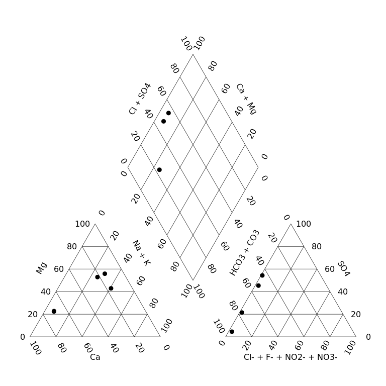

<!-- README.md is generated from README.Rmd. Please edit that file -->

# `rems2aquachem`

<!-- badges: start -->

<!-- [](https://travis-ci.org/steffilazerte/rems2aquachem) -->

<!-- badges: end -->

The goal of `rems2aquachem` is to provide a quick and painless way of
converting EMS data into a format compatible with AquaChem.

Data is first downloaded with BC Govs
[`rems`](http://github.com/bcgov/rems) package, then formated for use by
AquaChem.

## Installation

You can install `rems2aquachem` from
[GitHub](https://github.com/steffilazerte/rems2aquachem).

``` r
install.packages("remotes")
remotes::install_github("steffilazerte/rems2aquachem", build_vignettes = TRUE)
```

If you run into errors right at the start, consider updating your
packages.

``` r
remotes::update_packages()
```

## Usage

### R command line

Downloads, converts and saves to csv

``` r
library(rems2aquachem)
r <- rems_to_aquachem(ems_ids = c("1401030", "1401377", "E292373"))
#> Checking for locally stored historical data...
#> It appears that you already have the most up-to date version of the historic ems data.
#> Checking for locally stored recent data...
#> Fetching data from cache...
r
#> # A tibble: 16 x 142
#>    StationID SampleID Sample_Date Analysis_Date Project Watertype shortWatertype
#>    <chr>     <chr>    <chr>       <chr>         <chr>   <chr>     <chr>         
#>  1 ""        ""       ""          ""            ""      ""        ""            
#>  2 "075"     "140103… "1987-07-0…  <NA>         "BACKG… "Fresh W…  <NA>         
#>  3 "075"     "140103… "1991-08-0…  <NA>         "BACKG… "Fresh W…  <NA>         
#>  4 "075"     "140103… "1994-06-0…  <NA>         "BACKG… "Fresh W…  <NA>         
#>  5 "075"     "140103… "2001-09-0…  <NA>         "BACKG… "Fresh W…  <NA>         
#>  6 "075"     "140103… "2009-11-1…  <NA>         "BACKG… "Fresh W…  <NA>         
#>  7 "075"     "140103… "2010-08-0…  <NA>         "BACKG… "Fresh W…  <NA>         
#>  8 "075"     "140103… "2016-11-0…  <NA>         "BACKG… "Fresh W…  <NA>         
#>  9 "075"     "140103… "2018-06-1…  <NA>         "BACKG… "Ground …  <NA>         
#> 10 "203"     "140137… "1987-07-0…  <NA>         "BACKG… "Fresh W…  <NA>         
#> 11 "203"     "140137… "1989-10-1…  <NA>         "BACKG… "Fresh W…  <NA>         
#> 12 "203"     "140137… "1994-03-2…  <NA>         "BACKG… "Fresh W…  <NA>         
#> 13 "203"     "140137… "2016-11-0…  <NA>         "BACKG… "Fresh W…  <NA>         
#> 14 "203"     "140137… "2020-06-2…  <NA>         "BACKG… "Ground …  <NA>         
#> 15 "426"     "E29237… "2015-03-0…  <NA>         "GROUN… "Fresh W…  <NA>         
#> 16 "426"     "E29237… "2017-10-1…  <NA>         "GROUN… "Fresh W…  <NA>         
#> # … with 135 more variables: Comment <chr>, Reference <chr>,
#> #   Quality_control <chr>, Duplicate_ID <chr>, Labcode <chr>, Location <chr>,
#> #   Geology <chr>, Coord_Lat <chr>, Coord_Long <chr>, X <chr>, Y <chr>,
#> #   Elevation <chr>, Well_Depth <chr>, Screen_Top <chr>, Screen_Mid <chr>,
#> #   Screen_Bottom <chr>, Gradient <chr>, Station_Comment <chr>,
#> #   Sample_Depth <chr>, Temp <chr>, pH_lab <chr>, Cond <chr>, Meas_Alk <chr>,
#> #   CO3 <chr>, HCO3 <chr>, Cl <chr>, F <chr>, Meas_Hardness <chr>, NH4 <chr>,
#> #   NO3 <chr>, NO2 <chr>, SO4 <chr>, Ag_diss <chr>, Al_diss <chr>,
#> #   As_diss <chr>, B <chr>, Ba <chr>, Ca <chr>, Cd_diss <chr>, Cr_diss <chr>,
#> #   Cu_diss <chr>, DO <chr>, Fe_diss <chr>, K <chr>, Mg <chr>, Mn_diss <chr>,
#> #   Mo_diss <chr>, Na <chr>, Ni_diss <chr>, Pb_diss <chr>, pH_field <chr>,
#> #   Sb_diss <chr>, Cond_field <chr>, Se_diss <chr>, Si <chr>, Sr <chr>,
#> #   Tl_diss <chr>, U_diss <chr>, V_diss <chr>, Zn_diss <chr>, Cd_tot <chr>,
#> #   Zn_tot <chr>, Fe_tot <chr>, Cu_tot <chr>, Ni_tot <chr>, Al_tot <chr>,
#> #   Tl_tot <chr>, As_tot <chr>, Sb_tot <chr>, V_tot <chr>, Mo_tot <chr>,
#> #   Ag_tot <chr>, Pb_tot <chr>, Li <chr>, Mn_tot <chr>, U_tot <chr>, Br <chr>,
#> #   `Acidity_pH_4_5_(as_CaCO3)` <chr>, `Acidity_pH_8_3_(as_CaCO3)` <chr>,
#> #   `Alkalinity;_Phenolphthalein_(as_CaCO3)` <chr>, Anion_Sum <chr>,
#> #   Barium_Total <chr>, Beryllium_Dissolved <chr>, Beryllium_Total <chr>,
#> #   Bismuth_Dissolved <chr>, Bismuth_Total <chr>, Boron_Total <chr>,
#> #   Calcium_Total <chr>, Carbon_Dissolved_Organic <chr>, Cation_Sum <chr>,
#> #   `Cation-Anion_Balance_%=100*(Cations-Anions)/(Cations+Anions)` <chr>,
#> #   Chromium_Total <chr>, Cobalt_Dissolved <chr>, Cobalt_Total <chr>,
#> #   Cyanide_WAD <chr>, `Hardness_Total_(Total)` <chr>,
#> #   `Hydroxide_Alkalinity_(as_CaCO3)` <chr>, Lithium_Total <chr>,
#> #   Magnesium_Total <chr>, `Nitrate(NO3)_+_Nitrite(NO2)_Dissolved` <chr>, …
```

Create plots

``` r
piper_plot(r, ems_id = "1401030")
```



``` r
stiff_plot(r, ems_id = "1401030")
```


### Shiny GUI

Launch the shiny GUI with the function `ac_gui()`

``` r
ac_gui()
```


## Vignette/Tutorials

After installing `rems2aquachem` you can access the Walkthrough vignette
with:

``` r
vignette("walkthrough", package = "rems2aquachem")
```
