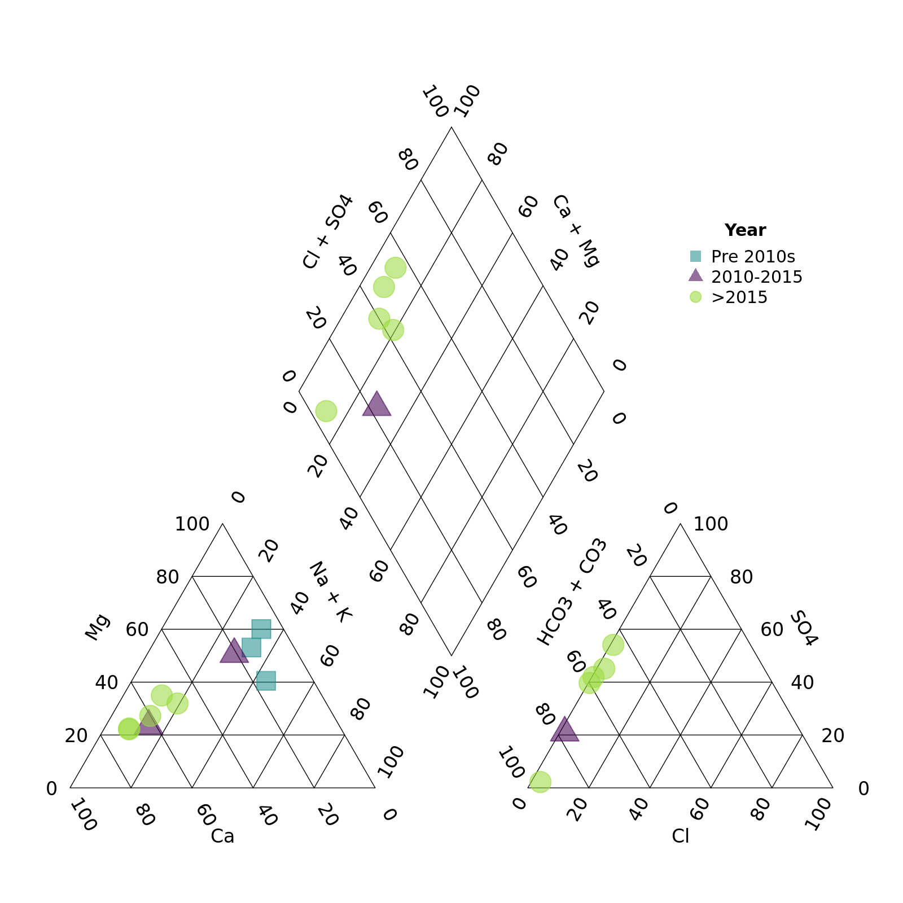

rems2aquachem has a function for creating piper plots based on functions from the 
USGS package smwrGraphs. 
With `piper_plot()` we can create custom piper plots using data
from EMS but with the option to add grouping variables from other data sets. 

This vignette will walk you through how to create custom piper plots using the 
`piper_plot()` function in R.

> Note: Currently you can only customize your piper plots in R (not via the
Shiny app). 

Let's get started!

First we'll load the packages we want to use


```r
library(rems2aquachem)  # To download EMS data and create piper plots
library(dplyr)          # To manipulate our data
library(lubridate)      # To manipulate dates
knitr::opts_chunk$set(fig.width = 8, fig.asp = 1)
```


Now let's get our data by downloading from EMS (using the rems
package under the hood). Because `rems_to_aquachem()` is generally used for 
exporting data to AquaChem, we use the `save = FALSE` argument to avoid saving 
to disk, and then use the `units_remove()` function to remove the units normally stored
in the first row of AquaChem data.


```r
r <- rems_to_aquachem(ems_ids = c("1401030", "1401377", "E292373"), save = FALSE)
#> Checking for locally stored historical data...
#> Last download was 2 days ago
#> If you would like to update historical data, run 'rems::download_historic_data()'
#> Checking for locally stored recent data...
#> Fetching data from cache...
#> For consistency EMS charge balances, anion sums, and cation sums have been replaced with recalculated values.
#> See `?charge_balance` for more details.
r <- units_remove(r)
```

Let's take a quick look... lots of data!

```r
r
#> # A tibble: 15 × 178
#>    Sample_Date SampleID  Coord_Lat Project     Coord_Long StationID Watertype Analysis_Date shortWatertype Comment
#>    <date>      <chr>         <dbl> <chr>            <dbl> <chr>     <chr>     <date>        <chr>          <chr>  
#>  1 1987-07-07  1401030-1      49.2 BACKGROUND       -120. 075       Fresh Wa… NA            <NA>           <NA>   
#>  2 1991-08-07  1401030-2      49.2 BACKGROUND       -120. 075       Fresh Wa… NA            <NA>           <NA>   
#>  3 1994-06-08  1401030-3      49.2 BACKGROUND       -120. 075       Fresh Wa… NA            <NA>           <NA>   
#>  4 2001-09-09  1401030-4      49.2 BACKGROUND       -120. 075       Fresh Wa… NA            <NA>           <NA>   
#>  5 2009-11-11  1401030-5      49.2 BACKGROUND       -120. 075       Fresh Wa… NA            <NA>           <NA>   
#>  6 2010-08-09  1401030-6      49.2 BACKGROUND       -120. 075       Fresh Wa… NA            <NA>           <NA>   
#>  7 2016-11-02  1401030-7      49.2 BACKGROUND       -120. 075       Fresh Wa… NA            <NA>           <NA>   
#>  8 2018-06-14  1401030-8      49.2 BACKGROUND       -120. 075       Ground W… NA            <NA>           <NA>   
#>  9 1987-07-07  1401377-1      49.2 BACKGROUND       -120. 203       Fresh Wa… NA            <NA>           <NA>   
#> 10 1989-10-11  1401377-2      49.2 BACKGROUND       -120. 203       Fresh Wa… NA            <NA>           <NA>   
#> 11 1994-03-24  1401377-3      49.2 BACKGROUND       -120. 203       Fresh Wa… NA            <NA>           <NA>   
#> 12 2016-11-02  1401377-4      49.2 BACKGROUND       -120. 203       Fresh Wa… NA            <NA>           <NA>   
#> 13 2020-06-29  1401377-5      49.2 BACKGROUND       -120. 203       Ground W… NA            <NA>           <NA>   
#> 14 2015-03-06  E292373-1      49.4 GROUNDWATER      -125. 426       Fresh Wa… NA            <NA>           <NA>   
#> 15 2017-10-11  E292373-2      49.4 GROUNDWATER      -125. 426       Fresh Wa… NA            <NA>           <NA>   
#> # … with 168 more variables: Reference <chr>, Quality_control <chr>, Duplicate_ID <chr>, Labcode <chr>,
#> #   Location <dbl>, Geology <chr>, X <dbl>, Y <dbl>, Elevation <dbl>, Well_Depth <dbl>, Screen_Top <dbl>,
#> #   Screen_Mid <dbl>, Screen_Bottom <dbl>, Gradient <chr>, Station_Comment <chr>, Sample_Depth <dbl>, Temp <dbl>,
#> #   `14C` <dbl>, `18O` <dbl>, `2H` <dbl>, Ag_diss <dbl>, Ag_tot <dbl>, Al_diss <dbl>, Al_tot <dbl>,
#> #   As_diss <dbl>, As_tot <dbl>, B <dbl>, B_tot <dbl>, Ba <dbl>, Ba_tot <dbl>, Benzene <dbl>, Br <dbl>, Ca <dbl>,
#> #   Ca_tot <dbl>, Cd_diss <dbl>, Cd_tot <dbl>, Cl <dbl>, CN_diss <dbl>, CN_tot <dbl>, Co_diss <dbl>,
#> #   Co_tot <dbl>, CO3 <dbl>, Cond <dbl>, Cond_field <dbl>, Cr_diss <dbl>, Cr_III_diss <dbl>, Cr_tot <dbl>, …
```

By default, the piper plot creates a plot with points coloured by EMS ID.


```r
piper_plot(d = r)
```


We can override this by specifying the `group` argument ourselves. In this
case, let's create a column `Year` and colour points that.


```r
r <- mutate(r, Year = year(Sample_Date))

piper_plot(d = r, group = "Year")
```


We can also customize the appearance of the points. 

First let's create some year categories to group by. We'll also turn this variable
into a factor (category) and specify the order of the levels so our legend is
in the correct order.


```r
r <- mutate(r, 
            Year_cat = case_when(Year < 2010 ~ "Pre 2010s",
                                 Year >= 2010 & Year <= 2015 ~ "2010-2015",
                                 Year > 2015 ~ ">2015"),
            Year_cat = factor(Year_cat, 
                              levels = c("Pre 2010s", "2010-2015", ">2015")))
```

Note that we need to match the number of groups to the number of colours, 
shapes, etc. or supply only one value. For example, here we want all the points
to be large and open, so we specify `point_size = 0.2` and `point_filled = FALSE`.


```r
piper_plot(d = r, group = "Year_cat",
           point_colour = c("#21908C", "#440154", "#9AD93C"), 
           point_shape = c("square", "triangle", "circle"), 
           point_filled = FALSE, point_size = 0.2)
```


Hmm, those points are a bit tough to see


```r
piper_plot(d = r, group = "Year_cat",
           point_colour = c("#21908C", "#440154", "#9AD93C"), 
           point_shape = c("square", "triangle", "circle"), 
           point_filled = TRUE, point_size = 0.2)
```


Perhaps with a bit of transparency? We can add this by adding two digits to the
end of our colour codes. `"#21908C"` -> `"#21908C90`" adds a touch of transparency.
(We can also omit `point_filled = TRUE` as points are filled by default.)


```r
piper_plot(d = r, group = "Year_cat",
           point_colour = c("#21908C90", "#44015490", "#9AD93C90"), 
           point_shape = c("square", "triangle", "circle"), 
           point_size = 0.2)
```


Finally we can adjust the legend position and title

```r
piper_plot(d = r, group = "Year_cat",
           point_colour = c("#21908C90", "#44015490", "#9AD93C90"), 
           point_shape = c("square", "triangle", "circle"), 
           point_size = 0.2, 
           legend_position = "topright",
           legend_title = "Year")
```


We can put the legend anywhere we want. Think about the plot area as running
from -1 to 1 from left to right (x) and -1 to 1 from top to bottom (y). 
We then specify the (x,y) coordinates that we want. You can even go out of the 
plotting area by specifying numbers out of the -1 to 1 range.


```r
piper_plot(d = r, group = "Year_cat",
           point_colour = c("#21908C90", "#44015490", "#9AD93C90"), 
           point_shape = c("square", "triangle", "circle"), 
           point_size = 0.2, 
           legend_position = c(-1.5, 1),
           legend_title = "Year")
```



