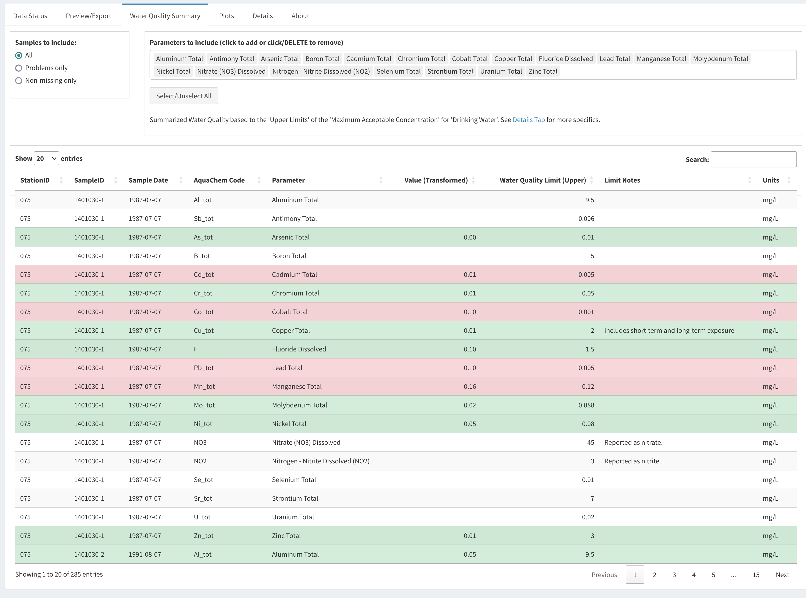

```{r, include = FALSE}


knitr::opts_chunk$set(
  collapse = TRUE,
  comment = "#>",
  fig.align = "center"
)

library(knitr)
```

## Opening the GUI

In the R console type the following, hiting enter after each line. This will launch the Shiny App.

```{r setup, eval = FALSE}
library(rems2aquachem)
ac_gui()
```


## Updating Data

The first time you launch the Shiny App your data sources will likely be out of date.

```{r, echo = FALSE, out.width = "80%"}

```

1. Click on **Update recent data (2yr)** to download the `rems` recent dataset. You will see a progress message in the lower right corner. If you look at the R console, you will see the progress bar advance.

```{r, echo = FALSE, out.width = "80%"}
include_graphics("figures/update_progress_console.png")
```

2. Next, click on **Update historic data** to download the `rems` historic dataset. As above, you will see a progress message in the lower right corner and if you look at the R console, you will see the progress bar advance.

```{r, echo = FALSE, out.width = "80%"}
include_graphics("figures/out-of-date2.png")
```

> **Note**   
>
> - Together these datasets are ~ 6.5 GB  
> - You'll have to wait for both status to be green before you can proceed
> - Historical Data is now being updated daily, but this is a **large** download
>   so you may not want to update it unless you have good reason


## Selecting data

**EMS IDs**

In order to download EMS data, you'll need to know the EMS IDs for the sites in question. These are Alpha-Numeric with 7 digits, e.g., 1401030, 1401377, E292373

```{r, echo = FALSE, out.width = "40%"}
include_graphics("figures/ems_ids.png")
```

Type the EMS IDs into the the "EMS IDs" field. For multiple IDs, separate them by commas. They can be plain, or surrounded by quotes (")

```{r, echo = FALSE, out.width = "40%"}
include_graphics("figures/ems_ids2.png")
```

**Dates**

If you want the full date range, simply leave the range as is and click on **"Get and convert EMS data"**

If you want a particular date range, select the first and last dates you wish to include (this applies to the complete date range). Click on **"Get and convert EMS data"**.


```{r, echo = FALSE, out.width = "40%"}
include_graphics("figures/dates.png")
```

### Previewing data

You can choose which columns to preview by selecting either "Relevant Columns" (default) or "All Columns". Relevant columns only show metadata, cations, anions and charge balance. **ALL data is downloaded, this only affects the preview**.

```{r, echo = FALSE, out.width = "40%"}

```

The results of your ID, date and data filtering will be available under the **Results** tab. 

You can scroll and sort through the data to ensure you have the data you wanted.

The `charge_balance` and `charge_balance2` values will be highlighted in green (value ranges from -10% to 10%) or red (values < -10% or > 10%) to indicate possibly problematic samples.
`charge_balance` represents the EMS-calculated charge balances or and `charge_balance2` the rems2aquachem-calculated balances.


> **Note** This may take a few minutes, depending on the amount of data you have requested.


```{r, echo = FALSE, out.width = "100%"}
include_graphics("figures/results.png")
```


## Downloading data

If you are satisfied with the data, click on "Download to CSV" to download a comma-separate file (.csv) or click on "Download to Excel" to download a colour-coded Excel file of the data (.xlsx).

```{r, echo = FALSE, out.width = "100%"}
include_graphics("figures/results2.png")
```


## Missing data

Not all EMS stations have data for all dates, or even any data at all. Be sure to check the "Data Messages" window on the **REM Status** tab for status messages regarding any missing data.

```{r, echo = FALSE, out.width = "80%"}
include_graphics("figures/missing_data.png")
```

```{r, echo = FALSE, out.width = "80%"}
include_graphics("figures/missing_data2.png")
```

## Water Quality Summary

The Water Quality Summary tab displays information on whether specific compounds 
exceed Drinking Water quality guidelines (guidelines from the [Data Catalogue](https://catalogue.data.gov.bc.ca/ca/dataset/85d3990a-ec0a-4436-8ebd-150de3ba0747)
accessed via the `bcdata` package).

By default, all relevant parameters are included (see the list at the top).
Parameters can be omitted individually (clicking on a parameter and using the DELETE button)
or can be all added or all removed (via the "Select/Unselect All" button).

Parameters can also be filtered to only show those for which there are problematic
values ("Problems only" radio button), or for which there are non-missing data ("Non-missing only" radio button).

Parameters that exceed the Drinking Water Quality Limit are highlighted in red.
Those that do not exceed the limit are highlighted in green.
Those for which we do not have data are left white.

```{r, echo = FALSE, out.width = "80%"}

```

**Note:** Values have been transformed *in this table only* ("Value (Transformed)")
to match the units in the Drinking Water quality guidelines ("Units").
All comparisons are only upper limit exceedances. 

## Plots

Plots can be previewed by clicking on the **Plots** tab.

From the drop-down menu on the left, select the EMS ID of the site you wish to view. To download **ALL** plots (i.e. not just the ones you can see), click on the "Download All Plots" button. This will zip the individual plots and ask you where to save the file.

If you wish, you can change the plot settings on the left hand side by including questionable data (**Omit 'bad' charge balances?**; where the charge balance is > 10 or < -10) or omitting sample legends on the piper plot (**Piper plot legend**).

```{r, echo = FALSE, out.width = "80%"}
include_graphics("figures/plots.png")
```


## FAQ

1. When in doubt, restart RStudio

2. If you run into errors right at the start, try updating your packages:

  ```{r, eval = FALSE}
  remotes::update_packages()
  ```

3. Remember that the output is optimized for AquaChem, not necessarily for other data analyses (i.e. the second row of the data frame is for units, which wouldn't work in R)


```
# Copyright 2021 Province of British Columbia
# 
# Licensed under the Apache License, Version 2.0 (the "License");
# you may not use this file except in compliance with the License.
# You may obtain a copy of the License at 
# 
# http://www.apache.org/licenses/LICENSE-2.0
# 
# Unless required by applicable law or agreed to in writing, software
# distributed under the License is distributed on an "AS IS" BASIS,
# WITHOUT WARRANTIES OR CONDITIONS OF ANY KIND, either express or implied.
# See the License for the specific language governing permissions and
# limitations under the License.
```
