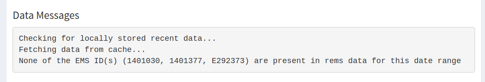

```{r, include = FALSE}
knitr::opts_chunk$set(
  collapse = TRUE,
  comment = "#>",
  fig.align = "center"
)

library(knitr)
```

```{r setup}
library(rems2aquachem)
```


## Updating Data

The first time you launch the Shiny App your data sources will likely be out of date.

```{r, echo = FALSE, out.width = "80%"}
include_graphics("out-of-date.png")
```

1. Click on **Update recent data (2yr)** to download the `rems` recent dataset. You will see a progress message in the lower right corner. If you look at the R console, you will see the progress bar advance.

```{r, echo = FALSE, out.width = "80%"}
include_graphics("update_progress_console.png")
```

2. Next, click on **Update historic data** to download the `rems` historic dataset. As above, you will see a progress message in the lower right corner and if you look at the R console, you will see the progress bar advance.

```{r, echo = FALSE, out.width = "80%"}
include_graphics("update_historical2.png")
```

> **Note**   
>
> - Together these datasets are ~ 6.5 GB  
> - You'll have to wait for both status to be green before you can proceed


## Selecting data

**EMS IDs**

In order to download EMS data, you'll need to know the EMS IDs for the sites in question. These are Alpha-Numeric with 7 digits, e.g., 1401030, 1401377, E292373

```{r, echo = FALSE, out.width = "40%"}

```

Type the EMS IDs into the the "EMS IDs" field. For multiple IDs, separate them by commas. They can be plain, or surrounded by quotes (")

```{r, echo = FALSE, out.width = "40%"}
include_graphics("ems_ids2.png")
```

**Dates**

If you want the full date range, simply leave the range as is and click on "Get and convert EMS data"

If you want a particular date range, select the first and last dates you wish to include (this applies to the complete date range). Click on "Get and convert EMS data".


```{r, echo = FALSE, out.width = "40%"}
include_graphics("dates.png")
```

### Viewing data

The results of your ID and date filtering will be available in the lower half of the window. You can scroll and sort through the data to ensure you have the data you wanted.

> **Note** This may take a few minutes, depending on the amount of data you have requested.


```{r, echo = FALSE, out.width = "100%"}

```


## Downloading data

If you are satisfied with the data, click on "Download to CSV" to download a comma-separate file (.csv) or click on "Download to Excel" to download a colour-coded Excel file of the data (.xlsx).

```{r, echo = FALSE, out.width = "100%"}
include_graphics("results2.png")
```


## Missing data

Not all EMS stations have data for all dates, or even any data at all. Be sure to check the "Data Messages" window for status messages regarding any missing data.

```{r, echo = FALSE, out.width = "80%"}

```

```{r, echo = FALSE, out.width = "80%"}
include_graphics("missing_data2.png")
```

## FAQ

1. When in doubt, restart RStudio

2. If you run into errors right at the start, try updating your packages:

```{r, eval = FALSE}
remotes::update_packages()
```

3. Remember that the output is optimaized for AquaChem, not necessarily for other data analyses (i.e. the second row of the data frame is for units, which wouldn't work in R)

